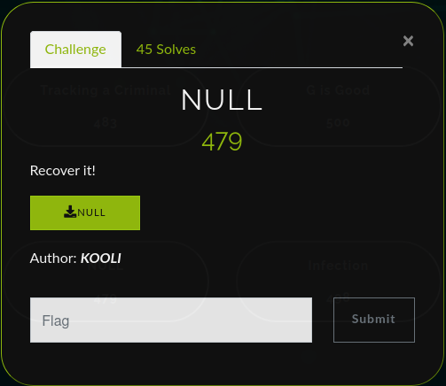
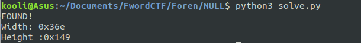

# NULL Writeup
## 479 points (45 Solves)


Basically we are given a [corrupted file](NULL) that we need to recover!

## Solution:

First, let's open the corrupted file in hex editor. I will use GHex:


We can clearly spot from the header that we will have to deal with a corrupted PNG. But we notice that the first byte is corrupted. Let's fix that!

**69 50 4e 47 0d 0a 1a 0a** becomes **89 50 4e 47 0d 0a 1a 0a**.

Reading about [PNG specification](http://www.libpng.org/pub/png/spec/1.2/PNG-Chunks.html) we must expect an IHDR chunk as the FIRST chunk. 

The ihdr chunk appears to be corrupted too. **00 00 00 0D** is the length of the IHDR chunk and this is usual and correct so let's skip it.

The 4 first bytes are the chunk type and it must be **49 48 44 52** for IHDR. So we fix that too. Our file will look like:


Okay, to be sure what to do next let's run pngcheck on our file at this state.


We've got an **invalid IHDR image dimensions (0x0)**.

> *What info does the IHDR provide?*  
>
The IHDR chunk tells about:    
   - Width:              4 bytes  
   - Height:             4 bytes  
   - Bit depth:          1 byte  
   - Color type:         1 byte  
   - Compression method: 1 byte  
   - Filter method:      1 byte  
   - Interlace method:   1 byte 

Now we've got a problem. The bytes for the width and the height of our file are all set to **NULL** bytes. We can't just choose arbitrary dimensions and expect our PNG to work correctly . Even if we manage to correct the crc and open the PNG with a random width , height we will mess up the pixels and the image will look like ~garbage~. So the only solution is to recover the original width and height!

To do that we need the crc checksum of the IHDR chunk. It comes just after the chunk encoded on 4 bytes. In our case the crc checksum is: **E3 67 7E C0**  
We will have to bruteforce the dimensions until we get the correct crc we need! Knowing that both width and height are encoded in 4 bytes the maximum value of the width/height is 2^31. We wouldn't enjoy bruteforcing that, so let's try to fix as maximum value 2000px and hope it works.

```python
from binascii import crc32

correct_crc = int.from_bytes(b'\xe3\x67\x7e\xc0',byteorder='big')

for h in range(2000):
	for w in range(2000):
		crc=b"\x49\x48\x44\x52"+w.to_bytes(4,byteorder='big')+h.to_bytes(4,byteorder='big')+b"\x08\x06\x00\x00\x00"
		if crc32(crc) % (1<<32) == correct_crc:
			print ('FOUND!')
			print ('Width: ',end="")
			print (hex(w))
			print ('Height :',end="")
			print (hex(h))
			exit()
```


Great! now we recovered the original width and height using the crc32. Let's hope that works!  
If you're wondering why we used the modulo (1<<32) in the script, it's because the crc32 from binascii is doing a signed crc32.


running pngcheck again would give us **OK: NULL.png (878x329, 32-bit RGB+alpha, non-interlaced, 98.3%).** We open the [image](NULL.png) and enjoy our flag!


**FLAG: FwordCTF{crc32_is_the_way}**
